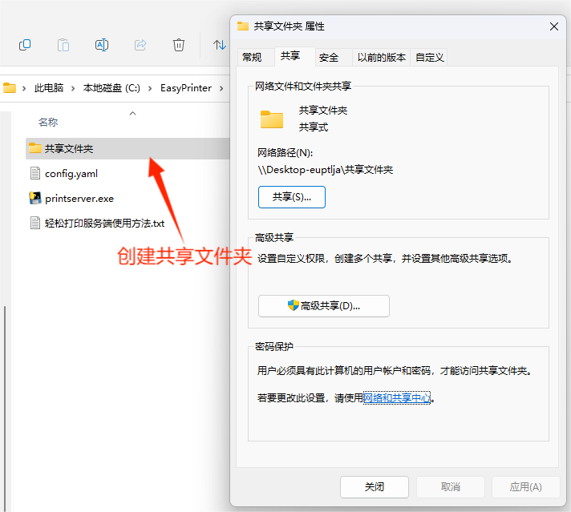
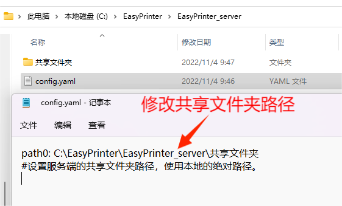
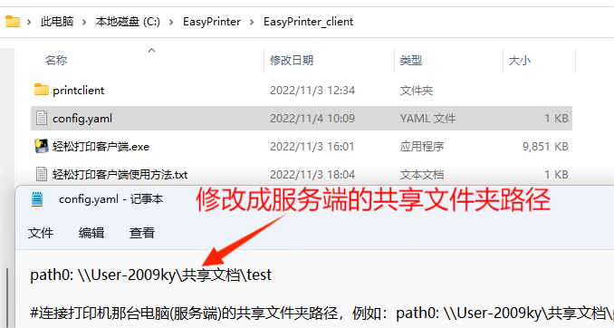
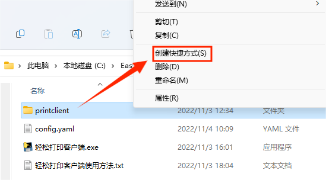
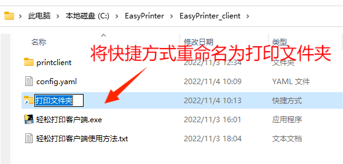
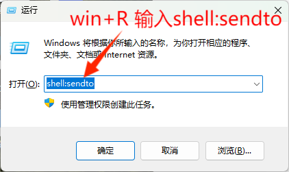
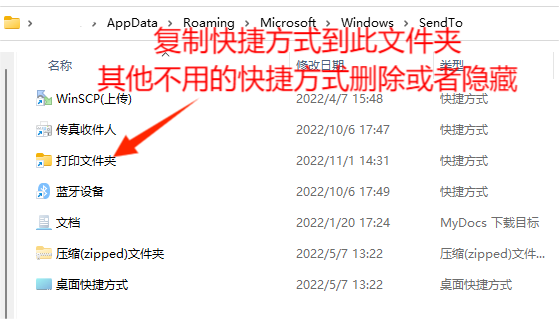
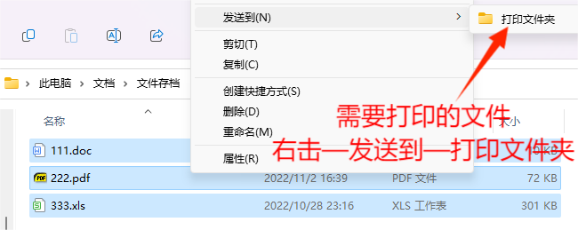

# 轻松打印EasyPrinter：一个免驱动的局域网打印平台，老式打印机福音

### 1.介绍
由于某些老式打印机没有无线功能，导致在局域网共享打印机变得十分麻烦，而且有些打印机驱动不支持win10、win11这些新系统，如果想打印只能复制到连接打印机的那台电脑上打印，十分不方便。而有时只想简单的黑白打印文档，不需要彩色和双面打印，那有没有一款软件解决这一痛点？
   
答案当然是有的，轻松打印EasyPrint就是致力于局域网内免驱动打印，只要局域网中有一台windows电脑有线连接到打印机，局域网内所有设备都能使用这台打印机进行简单打印。


### 2.软件架构
软件分为服务端和客户端，服务端安装在连接打印机的windows电脑，客户端安装在局域网内其他任意电脑，支持pdf、word、Excel文件的打印。


### 3.安装教程

#### 3.1   前期准备：

```
3.1.1  服务端和客户端电脑都先要安装办公软件，微软office和wps均可。

3.1.2  服务端电脑开启共享文件夹功能，新建一个共享文件夹作为打印文件夹，并记下它的路径。

3.1.3  确保客户端电脑能访问服务端的共享文件夹。

```
开启共享文件夹教程：[点此处](https://zhuanlan.zhihu.com/p/402820328)
#### 3.2   下载EasyPrinter_server.rar到服务端电脑任意位置解压。[EasyPrinter_server.rar此处下载](https://cowtransfer.com/s/4e5b7e4acdd54a)
           

#### 3.3   下载EasyPrinter_client.rar到客户端电脑任意位置解压。[EasyPrinter_client.rar此处下载](https://cowtransfer.com/s/f6cb3b27e79d4b)
           
### 4.使用说明

#### 4.1   服务端使用说明

```
4.1.1  先修改同一目录下的config.yaml文件，指定服务端共享文件夹的本地路径。

4.1.2  运行“轻松打印服务端.exe”。

```
4.1.1



4.1.2



#### 4.2   客户端使用说明


```
4.2.1  先修改同一目录下的config.yaml文件，指定服务端的共享文件夹路径。

4.2.2  右击同一目录下的printclient文件夹，创建快捷方式，将printclient快捷方式重命名为打印文件夹。

4.2.3  按组合键“win+R”，打开“运行”，输入shell:sendto，按确定打开SendTo文件夹，将刚才的打印文件夹快捷方式复制到这。
       (SendTo即右击文件“发送到”菜单，除打印文件夹，其他快捷方式可以右击——属性——隐藏)

4.2.4  运行“轻松打印客户端.exe”。

4.2.5  文档完成编辑并保存，退出office软件后，右击需要打印的文件，点“发送到”打印文件夹，静待数秒后，服务端的默认打印机就会自动打印。

```

4.2.1



4.2.2






4.2.3





4.2.5



#### 4.3   注意事项

```
4.3.1  服务端和客户端所创建的文件夹在上传前不能有任何文件，不然会自动打印并删除。

4.3.2  上传文件尽量使用复制命令，避免使用剪切。

```

### 参与贡献

1.  [Brian](https://bzsln.cn/)
2.  [linzxc](https://gitee.com/linzxc)

### 关于打赏
如果您喜欢本项目，欢迎打赏 :gift_heart: 


